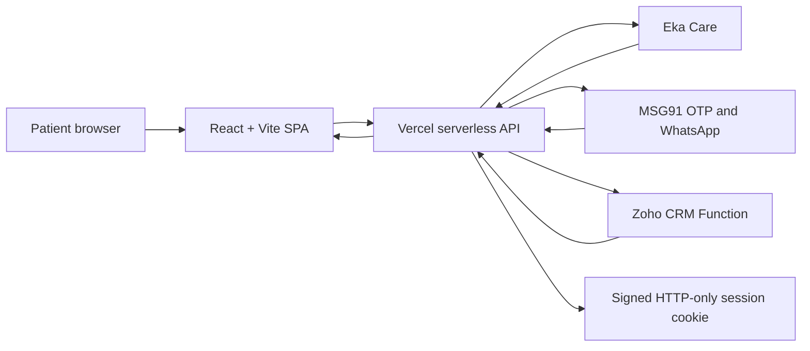

# Docty Clinics Patient Application

## Project and Operations Handbook

**Version:** 1.0  
**Document date:** June 19, 2026  
**Production:** https://docty-clinics-patient-app-eta.vercel.app  
**Repository application:** `docty-clinics-patient-app`

> This handbook describes the application as currently implemented. Never place production API keys, access tokens, session secrets, or signed URLs in source control or documentation.

## 1. Executive Summary

The Docty Clinics Patient Application is a responsive healthcare website and patient portal for discovering clinics, doctors, services, health checks, and subscription plans. It supports doctor appointment booking, no-slot appointment requests, mobile OTP authentication, multiple patient profiles under one mobile number, patient appointment history, clinic lead capture, CRM submission, and WhatsApp confirmations.

The application is a React single-page application deployed on Vercel. Vercel serverless functions provide a protected backend layer between the browser and third-party services:

- **Eka Care** supplies clinics, doctors, services, appointment slots, patient profiles, and appointments.
- **MSG91** supplies OTP authentication and WhatsApp lead confirmations.
- **Zoho CRM** receives standardized clinic leads.
- **Vercel** hosts the frontend, serverless APIs, environment variables, and production deployment.

The project does not maintain its own patient database. Patient and appointment data is retrieved from or written to Eka Care. Authentication state is maintained in a signed, HTTP-only session cookie.

## 2. Product Scope

### 2.1 Public website

- Homepage with services, doctors, clinics, health packages, and subscription highlights.
- Services catalogue with symptom/service search and related-service filtering.
- Doctor discovery with speciality, location, service, and name filtering.
- Doctor profiles with clinics, qualifications, experience, services, fees, consultation modes, and appointment slots.
- Clinic listing and individual clinic detail pages.
- Health checks/packages and annual subscription plan pages.
- Mobile-first fixed bottom navigation.
- Legal, consent, privacy, grievance, and policy pages.

### 2.2 Patient experience

- Mobile number authentication using a four-digit MSG91 OTP.
- Retrieval of one or more Eka Care patient profiles associated with the verified mobile number.
- Registration when no Eka profile exists.
- Add Family Member workflow.
- Profile selection, switching, and editing.
- Thirty-minute signed session that survives page refresh.
- Upcoming and past appointment display.
- Selected profile automatically reused during appointment and lead workflows.

### 2.3 Lead and communication workflows

- Request Appointment when no doctor slots are available.
- Quick service callback request.
- Pharmacy request.
- Health package request.
- Subscription plan request.
- General subscription interest request.
- Standardized Zoho CRM lead creation.
- MSG91 WhatsApp confirmation using the approved `service_booked` template.

## 3. Technology Stack

| Layer | Technology | Purpose |
|---|---|---|
| Frontend | React 19 + TypeScript | Application UI and client logic |
| Build tool | Vite 8 | Development server and production bundles |
| Routing | React Router | SPA page routing |
| Server state | TanStack Query | API fetching, cache, and retry behavior |
| Local state | React state + Jotai provider | UI and shared application state |
| UI primitives | Radix UI | Accessible dialogs, menus, selects, tabs, and controls |
| Styling | Tailwind CSS + project CSS | Responsive design and brand styling |
| Motion | Motion for React | Page and card transitions |
| Icons | Lucide + custom SVG service icons | General and service-specific iconography |
| Validation | Zod and server-side checks | Models and request validation |
| Hosting/backend | Vercel | Static hosting, rewrites, serverless functions, secrets |
| Clinical platform | Eka Care APIs | Doctors, clinics, patients, services, slots, appointments |
| Authentication/messaging | MSG91 | OTP and WhatsApp templates |
| CRM | Zoho CRM Function API | Clinic lead creation |

## 4. Brand and Design System

The interface follows the Docty brand book:

- **Vibrant Red:** `#FE065C`
- **Vibrant Blue:** `#0BB8FC`
- Primary dark text uses a deep healthcare navy.
- Typography uses Poppins in the application design.
- Cards use rounded corners, restrained borders, light shadows, and generous spacing.
- Service icons are custom SVG line illustrations using Vibrant Red and Vibrant Blue.
- Service icons automatically select relevant organs/body parts where possible, including heart, lungs, brain, spine, joints, eyes, kidneys, liver, skin, stomach, ear, and teeth.

The responsive design uses a conventional desktop header and a fixed mobile bottom navigation. The patient page suppresses unnecessary mobile footer content and booking controls.

## 5. Application Architecture



### 5.1 Architectural principles

- Third-party credentials remain on the server.
- Browser pages call same-origin `/api` endpoints.
- Patient sessions are signed and stored in secure cookies.
- No proprietary patient database is maintained by this application.
- Lead formatting is centralized before submission to Zoho.
- Current and future lead forms share one frontend submission contract and one backend CRM mapping.
- The application uses fallback UI and data behavior where external service data may be incomplete.

## 6. Repository Structure

```text
api/                         Vercel serverless API routes
  _lib/                      Shared MSG91 and Zoho integrations
  auth/                      OTP and logout endpoints
server/                      Session signing and verification
src/
  components/                Header, footer, logo, service icons, UI primitives
  data/                      Health package and subscription plan content
  generated/                 Generated models, validators, services, and hooks
  lib/                       API client, Eka mapping, sessions, leads, utilities
  pages/                     Route-level pages
public/                      Logos, favicon, and clinic imagery
docs/                        Project documentation
vercel.json                  SPA rewrites and cache headers
vite.config.ts               Vite configuration
tailwind.config.cjs          Tailwind configuration
.env.example                 Environment variable template without secrets
```

### 6.1 Important source files

| File | Responsibility |
|---|---|
| `src/app.tsx` | Providers and route definitions |
| `src/pages/_layout.tsx` | Shared page layout and scroll-to-top behavior |
| `src/components/header.tsx` | Desktop/mobile navigation and patient profile menu |
| `src/components/footer.tsx` | Footer navigation, contact, social, legal, and clinic links |
| `src/lib/eka-api.ts` | Eka Care data mapping and client operations |
| `src/lib/patient-session-context.tsx` | Patient authentication and profile state |
| `src/lib/clinic-leads.ts` | Reusable browser-side lead submission contract |
| `api/_lib/zoho-lead.ts` | Standardized Zoho lead mapping |
| `api/_lib/msg91-whatsapp.ts` | WhatsApp template submission |
| `server/patient-session.ts` | Signed session/token helpers |

## 7. Frontend Routes

| Route | Page | Primary purpose |
|---|---|---|
| `/` | Homepage | Discovery, quick requests, featured doctors, packages, clinics |
| `/services` | Services | Search and browse clinical services |
| `/health-plans` | Subscriptions | Browse and request annual plans |
| `/packages` | Checks | Browse and request health packages |
| `/locations` | Clinics | Browse clinic cards |
| `/locations/:id` | Clinic details | Clinic information, doctors, services, directions |
| `/book-appointment` | Doctor listing | Search/filter doctors and start booking |
| `/doctor/:id` | Doctor profile | Doctor details, slots, booking, request appointment |
| `/patient` | Patient portal | Login, profile management, appointments |
| `/privacy-policy` | Legal | Privacy policy |
| `/terms` | Legal | Terms of use |
| `/medical-disclaimer` | Legal | Medical disclaimer |
| `/cancellation-refund-policy` | Legal | Cancellation and refund policy |
| `/consent-notice` | Legal | Patient consent notice |
| `/grievance` | Legal | Grievance information |
| `/cookie-policy` | Legal | Cookie policy |
| `/children-dependants` | Legal | Children and dependants policy |

Vercel rewrites these routes to `index.html` so browser refreshes continue to work with client-side routing.

## 8. Core User Journeys

### 8.1 Find and book a doctor

1. The patient opens Doctors or follows a service link.
2. The doctor list can be filtered by name, speciality, service, or location.
3. The patient opens a doctor profile.
4. The application retrieves doctor services and appointment slots from Eka Care.
5. The user selects clinic, consultation mode, date, slot, and patient profile.
6. The user accepts the consent notice and terms.
7. The application books the appointment through Eka Care.

The consultation fee is read from the doctor's Eka Care Consultation service. If no valid fee exists, the application uses the default fallback of **INR 600**.

### 8.2 No slots available

1. If the selected doctor/date has no available slots, the CTA becomes **Request Appointment**.
2. The selected/logged-in patient details are included.
3. The request is submitted to `/api/appointment-lead`.
4. The backend validates the request.
5. The backend standardizes and sends the lead to Zoho CRM.
6. After Zoho succeeds, MSG91 sends the WhatsApp confirmation.
7. The patient sees a success message.

### 8.3 Authenticate and select a patient

1. The user submits an Indian mobile number.
2. `/api/auth/send-otp` asks MSG91 to send the configured OTP template.
3. The user enters the OTP; mobile devices may support OTP auto-read where the browser/OS permits it.
4. `/api/auth/verify-otp` verifies the OTP with MSG91.
5. A signed, secure, HTTP-only cookie is created for 30 minutes.
6. `/api/patients` retrieves Eka profiles for that mobile number.
7. The user selects a profile or registers if no profile exists.

### 8.4 Manage family profiles

- Multiple patients can be associated with the same mobile number.
- The header profile menu supports switching profiles, viewing appointments, adding a family member, and logging out.
- If only one profile exists, Switch Profile is disabled while Add Family Member remains available.
- Relationships are restricted to family relationships.
- Name, age, gender, and relationship can be edited from the patient dashboard.
- Switching profiles outside the patient page retains the current route.

### 8.5 View appointments

- Upcoming and past appointments are retrieved from Eka Care for the selected patient.
- Appointment status codes are converted into patient-friendly labels.
- Past visits display payment amount when present and a prescription download button when a prescription URL is available.
- Empty states show “No upcoming appointments found” or “No past visits found.”

## 9. Serverless API Reference

### 9.1 Application endpoints

| Endpoint | Method | Authentication | Purpose |
|---|---|---|---|
| `/api/doctors` | GET | Server credential | Retrieve and assemble doctor profiles and services |
| `/api/services` | GET | Server credential | Aggregate and deduplicate services across doctors |
| `/api/eka` | Multiple | Server credential | Protected proxy to Eka Care APIs |
| `/api/eka-public` | GET | None | Proxy selected public Eka content |
| `/api/auth/send-otp` | POST | None | Send OTP with MSG91 |
| `/api/auth/verify-otp` | POST | OTP | Verify OTP and create session |
| `/api/auth/logout` | POST | Cookie | Clear patient session |
| `/api/patient-session` | GET | Cookie | Check active session |
| `/api/patients` | GET | Cookie | Retrieve profiles for verified mobile |
| `/api/patient-selection` | POST | Cookie + signed profile token | Select active patient |
| `/api/patient-register` | POST | Cookie | Register patient/family member in Eka Care |
| `/api/patient-profile` | PATCH | Cookie + signed profile token | Update profile |
| `/api/patient-relationship` | PATCH | Cookie + signed profile token | Update family relationship |
| `/api/patient-appointments` | GET | Cookie | Retrieve selected patient's appointments |
| `/api/clinic-lead` | POST | Public form validation | Submit general clinic leads |
| `/api/appointment-lead` | POST | Public form validation | Submit no-slot doctor request |

### 9.2 Error behavior

- `400`: missing or invalid input.
- `401`: unauthenticated, expired, or invalid patient selection.
- `405`: unsupported method.
- `500`: missing server configuration.
- `502`: upstream third-party failure.
- `503`: reserved for unavailable service/configuration cases.

Frontend forms display server-provided error messages where safe. Lead forms do not show false success when Zoho or MSG91 fails.

## 10. Eka Care Integration

### 10.1 Data retrieved

- Business entities.
- Clinic summaries and details.
- Doctor profiles.
- Doctor services.
- Doctor public profile/experience information.
- Appointment slots by doctor, clinic, date, and mode.
- Patient profiles by verified mobile number.
- Patient appointments.

### 10.2 Data written

- Appointment bookings.
- New patient/family member registration.
- Patient profile updates.
- Relationship updates where supported by the Eka profile payload.

### 10.3 Mapping and fallback behavior

- Doctor services are deduplicated by normalized service name.
- Doctor profile services include all retrieved Eka doctor services.
- Doctor experience is derived from available public/professional data.
- Slot handling excludes expired slots and respects in-clinic/video mode.
- Missing consultation prices use INR 600.
- Missing or incomplete external data is represented with patient-friendly empty states.

### 10.4 Authentication headers

The backend supports different Eka authentication styles:

- Doctor/business endpoints generally use the `auth` header.
- Patient profile endpoints use `Authorization: Bearer ...` and, when configured, `client-id`.

Do not expose Eka tokens in browser-visible environment variables in production.

## 11. MSG91 Integration

### 11.1 OTP

- OTP template ID is provided through `MSG91_TEMPLATE_ID`.
- Mobile numbers are normalized to `91` plus a valid ten-digit Indian number.
- OTP expiry is requested as five minutes.
- The UI expects a four-digit OTP, while backend validation safely permits the provider-supported range.

### 11.2 WhatsApp

All successful clinic leads trigger the approved WhatsApp template:

- Integrated number: configured by `MSG91_WHATSAPP_INTEGRATED_NUMBER`.
- Template: configured by `MSG91_WHATSAPP_TEMPLATE_NAME`.
- Default template name: `service_booked`.
- Language: configured by `MSG91_WHATSAPP_TEMPLATE_LANGUAGE`.
- Namespace: configured by `MSG91_WHATSAPP_TEMPLATE_NAMESPACE`.

The current template uses no variables. Therefore, the WhatsApp message cannot include patient name, doctor, service, package, or appointment date until an approved parameterized template is supplied.

### 11.3 Lead delivery order

1. Validate the lead.
2. Submit the standardized lead to Zoho CRM.
3. Send MSG91 WhatsApp confirmation.
4. Return success to the browser.

If either required integration fails, the browser receives an error and should not display a successful submission.

## 12. Zoho CRM Lead Standard

Every current and future lead must be transformed by `api/_lib/zoho-lead.ts`. Forms must not construct ad hoc Zoho payloads.

### 12.1 Zoho fields

| Zoho field | Required content |
|---|---|
| `Name` | Patient/customer name |
| `Contact_Number` | Normalized ten-digit Indian mobile number |
| `Service` | One approved service value |
| `Location` | Clinic/location name or `Not specified` |
| `Remarks` | Context assembled from all other available lead details |

### 12.2 Approved Service values

1. Consultation
2. Pharmacy
3. Lab Tests
4. Physiotherapy
5. Dental
6. Home Care
7. Day Care

Explicit service values are preferred. If a form does not supply one, the backend infers the closest approved value from lead type, interest, speciality, and source. Unmatched leads default to Consultation.

### 12.3 Remarks content

Remarks include values when available:

- Age.
- Gender.
- Doctor name.
- Requested appointment date.
- Package name.
- Subscription plan or enquiry.
- Requested service.
- Consultation mode.
- Consultation fee.
- Additional notes.
- Lead source.
- Request timestamp.

If date of birth is available but age is not, age is calculated at submission time.

### 12.4 Current lead classifications

| Workflow | Zoho Service | Remarks emphasis |
|---|---|---|
| Doctor/no-slot request | Consultation, or inferred speciality category | Doctor, date, mode, fee, age, gender, clinic |
| General service request | Explicit/inferred approved category | Requested service and source |
| Pharmacy request | Pharmacy | Pharmacy order/request and source |
| Health package | Lab Tests | Exact package name |
| Subscription plan | Consultation | Exact plan/enquiry |
| Physiotherapy request | Physiotherapy | Requested service |
| Dental request | Dental | Requested service |
| Home care request | Home Care | Requested service |
| Day care request | Day Care | Requested service |

### 12.5 Adding a future lead form

Use `submitClinicLead` from `src/lib/clinic-leads.ts`:

```ts
await submitClinicLead({
  type: 'service',
  patientName,
  patientMobile,
  patientAge,
  patientGender,
  patientDob,
  serviceCategory: 'Home Care',
  interest: 'Post-operative nursing',
  location: selectedClinicName,
  remarks: 'Preferred callback after 5 PM',
  source: 'Home care landing page',
  metadata: { campaign: 'home-care-launch' },
});
```

Rules for future forms:

- Use only the approved `serviceCategory` values.
- Supply location whenever the user has selected a clinic.
- Put form-specific context in `interest`, `remarks`, or `metadata`.
- Never call Zoho or MSG91 directly from a browser component.
- Reuse `/api/clinic-lead` unless the workflow requires stronger validation.
- Do not expose the Zoho function URL or MSG91 auth key.

## 13. Patient Session and Security Model

### 13.1 Session lifecycle

- OTP verification creates a signed session.
- Cookie name: `docty_patient_session`.
- Cookie attributes: `HttpOnly`, `Secure`, `SameSite=Lax`, `Path=/`.
- Session duration: 30 minutes.
- Refreshing the page does not log the user out.
- Logout explicitly clears the cookie.
- Profile selection updates the signed session with the chosen patient ID.

### 13.2 Signed profile tokens

Patient lookup returns a signed access token for each profile. Profile selection and updates require both:

- A valid authenticated mobile session.
- A valid signed token associated with that same mobile number.

This reduces the risk of selecting or editing another patient's profile by changing a client-supplied ID.

### 13.3 Security requirements

- Keep all production secrets in Vercel encrypted environment variables.
- Do not add secrets to `.env.example`, Markdown, screenshots, logs, or client bundles.
- Rotate any credential accidentally shared in chat, email, issue trackers, or source control.
- Avoid `VITE_` prefixes for private values because Vite exposes them to the browser.
- Validate all mobile numbers server-side.
- Treat all third-party responses as untrusted.
- Use HTTPS-only production endpoints.
- Do not log full patient payloads or OTP values.

### 13.4 Data minimization

Only data required for booking, profile management, appointment retrieval, CRM follow-up, or patient communication should be transmitted. The application should not collect medical information unrelated to the selected workflow.

## 14. Environment Variables

Create a local `.env` from `.env.example`. Use real values locally only when necessary and never commit `.env`.

| Variable | Required | Scope | Purpose |
|---|---|---|---|
| `EKA_AUTH_TOKEN` | Yes | Server | Eka Care API authentication |
| `EKA_CLIENT_ID` | Usually | Server | Eka patient profile client identity |
| `PATIENT_SESSION_SECRET` | Yes | Server | Signs sessions and patient selection tokens |
| `MSG91_AUTH_KEY` | Yes | Server | MSG91 OTP and WhatsApp authentication |
| `MSG91_TEMPLATE_ID` | Yes | Server | OTP template |
| `MSG91_WHATSAPP_INTEGRATED_NUMBER` | Yes | Server | WhatsApp sender number |
| `MSG91_WHATSAPP_TEMPLATE_NAME` | Yes | Server | Approved WhatsApp template |
| `MSG91_WHATSAPP_TEMPLATE_LANGUAGE` | Yes | Server | WhatsApp template language |
| `MSG91_WHATSAPP_TEMPLATE_NAMESPACE` | Yes | Server | WhatsApp namespace |
| `ZOHO_CRM_LEAD_ENDPOINT` | Yes | Server | Zoho CRM Function URL with protected API-key query |
| `VITE_API_BASE_URL` | Optional | Browser/local | Development API base override |
| `VITE_EKA_AUTH_TOKEN` | Local only; discouraged | Browser/local | Direct local Eka testing |
| `VITE_EKA_CLIENT_ID` | Local only | Browser/local | Direct local Eka testing |

Generate `PATIENT_SESSION_SECRET` using a cryptographically secure random value of at least 32 bytes.

## 15. Local Development

### 15.1 Prerequisites

- Node.js compatible with the current Vite toolchain.
- npm.
- Access to required third-party development credentials.
- Vercel CLI for production-like serverless testing and deployment.

### 15.2 Install and run

```bash
npm install
npm run dev
```

The Vite development server starts the frontend. Because production APIs are implemented as Vercel functions, use Vercel local development when testing serverless routes end to end:

```bash
npx vercel dev
```

### 15.3 Quality commands

```bash
npm run build
npm run typecheck
npm run preview
```

`npm run build` is the production compilation gate currently used before deployments.

The project presently has known TypeScript compatibility warnings in some generated/UI utility files, particularly calendar/chart/resizable component typings, plus a doctor-slot nullability warning. These should be resolved as technical debt so `npm run typecheck` can become a strict CI gate.

## 16. Deployment to Vercel

### 16.1 Initial setup

1. Authenticate the Vercel CLI.
2. Link the repository to the Docty Clinics Vercel scope/project.
3. Add all server environment variables for Production.
4. Confirm `.env` is not committed.

### 16.2 Production deployment

```bash
npm run build
npx --yes vercel@latest deploy --prod --yes --scope doctyclinics
```

The stable production alias is:

```text
https://docty-clinics-patient-app-eta.vercel.app
```

### 16.3 Adding or updating a secret

```bash
npx --yes vercel@latest env add VARIABLE_NAME production --force --scope doctyclinics
```

Redeploy after changing environment variables because a deployment reads its environment at build/function deployment time.

### 16.4 Post-deployment checks

- Homepage loads without stale assets.
- Services and doctor cards load after hard refresh.
- Direct route refresh works.
- OTP send and verify work.
- Patient session survives refresh and expires after 30 minutes.
- Doctor slots match clinic, date, and mode.
- No-slot Request Appointment reaches Zoho and WhatsApp.
- Package and subscription requests reach Zoho and WhatsApp.
- Mobile bottom navigation remains fixed.
- Dialogs scroll and action buttons remain visible.

## 17. Data and UI Behavior

### 17.1 Services

- Services are aggregated from Eka doctor services.
- Duplicates are normalized and removed.
- Homepage service cards are randomized.
- The Services page searches both exact services and common symptom phrases.
- Search mappings include examples such as tooth pain, back pain, irregular periods, high sugar, blocked nose, and vaccination.
- Each card shows a relevant service focus rather than generic repeated inclusions.

### 17.2 Doctors

- Doctor cards show image, speciality, experience, locations, next availability, and consultation fee.
- Missing slots show “All Slots Booked.”
- The action becomes Request Appointment when no slots exist.
- Doctor profile Specialisations show specialties, while Services at this clinic shows the full service list.

### 17.3 Clinics

- Locations are presented as horizontal clinic cards.
- Clinic names omit redundant “Docty Clinics” wording where appropriate.
- Individual clinic headings use the clinic name.
- Clinic cards can show address, services, hours, doctor count, payment modes, walk-in support, details, directions, and call actions where data is available.

### 17.4 Packages and subscriptions

- Health package definitions are maintained in `src/data/health-packages.ts`.
- Subscription plan definitions are maintained in `src/data/health-plans.ts`.
- Package lead submissions map to Lab Tests in Zoho.
- Subscription enquiries map to Consultation unless a future business rule introduces another approved category.

## 18. Legal and Consent

The application includes:

- Privacy Policy.
- Terms of Use.
- Medical Disclaimer.
- Cancellation and Refund Policy.
- Consent Notice.
- Grievance page.
- Cookie Policy.
- Children and Dependants policy.

Appointment booking requires explicit consent to share selected patient details with the clinic and doctor and agreement to the Consent Notice and Terms of Use.

Legal text should be reviewed by qualified Indian healthcare/privacy counsel before major commercial launch or material workflow changes.

## 19. Testing Strategy

### 19.1 Smoke tests

- All public routes render.
- Header and footer links navigate directly.
- Mobile header and fixed bottom navigation render correctly.
- Services search returns related results and a useful empty state.
- Doctor list filters work.
- Clinic cards and detail pages load.

### 19.2 Authentication tests

- Valid mobile sends OTP.
- Invalid mobile is rejected.
- Correct OTP creates a session.
- Incorrect/expired OTP shows an error.
- Refresh preserves the session.
- Logout clears the session.
- Session expires after 30 minutes.
- No-profile mobile opens registration.
- Multiple profiles can be selected.

### 19.3 Appointment tests

- Slots load for each clinic, date, and consultation mode.
- Expired slots are not shown.
- Booking uses the selected patient.
- Consultation fee comes from service data or falls back to INR 600.
- No slots changes the CTA to Request Appointment.

### 19.4 Lead integration tests

Use a dedicated internal/test mobile number and remove test CRM records afterward.

- Verify Zoho fields: Name, Contact_Number, Service, Location, Remarks.
- Verify Service is always one approved value.
- Verify age and gender appear in Remarks when available.
- Verify doctor/date for appointment requests.
- Verify package name for health checks.
- Verify plan name for subscriptions.
- Verify WhatsApp is sent only after Zoho accepts the lead.
- Verify upstream failure displays an error rather than false success.

### 19.5 Security tests

- No secret appears in JavaScript bundles.
- API routes reject unsupported methods.
- Patient routes reject missing/invalid sessions.
- Signed patient selection cannot be reused for another mobile session.
- Invalid phone numbers never reach Zoho or MSG91.

## 20. Troubleshooting

### Services or doctors do not load after refresh

- Confirm `/api/services` and `/api/doctors` return `200`.
- Confirm `EKA_AUTH_TOKEN` exists in the active deployment.
- Check Vercel function logs.
- Confirm SPA rewrites are present.
- Hard refresh after a new deployment to invalidate old client assets.

### OTP is not received

- Confirm `MSG91_AUTH_KEY` and `MSG91_TEMPLATE_ID`.
- Confirm the mobile number is a valid Indian number.
- Check MSG91 template approval, balance, routing, and delivery logs.
- Confirm the sender/header configuration in MSG91.

### OTP verification fails

- Confirm the same normalized mobile is used for send and verify.
- Confirm the OTP has not expired.
- Confirm the current MSG91 key has OTP verification permission.
- Check Vercel logs without logging the OTP itself.

### Patient profiles are missing

- Confirm the mobile is verified and session cookie exists.
- Confirm Eka token/client ID.
- Confirm Eka has profiles associated with the same normalized mobile.
- If no profile exists, verify the registration state opens instead of showing only an error.

### Appointment slots are incorrect

- Confirm doctor ID, clinic ID, date, and consultation mode.
- Check timezone handling and expired-slot filtering.
- Inspect the raw Eka slot response through a protected development environment.

### Zoho leads fail

- Confirm `ZOHO_CRM_LEAD_ENDPOINT` is configured in Production.
- Confirm the Zoho function API key is active.
- Confirm the Zoho function accepts the five standardized JSON fields.
- Check Vercel logs and Zoho function execution logs.
- Rotate the key if it has been exposed.

### WhatsApp confirmation fails

- Confirm MSG91 auth key, integrated number, namespace, template, and language.
- Confirm `service_booked` remains approved.
- Confirm the patient number is WhatsApp-capable.
- Check MSG91 outbound WhatsApp logs.

## 21. Known Limitations and Technical Debt

- The application has no proprietary database; audit history and internal lead persistence depend on third parties.
- The current WhatsApp template has no dynamic variables.
- Appointment edit/cancel behavior depends on suitable Eka APIs and is not fully implemented end to end.
- Receipt retrieval is not implemented; payment amount is shown only when available in appointment data.
- Prescription download depends on a URL being present in upstream data.
- Zoho and MSG91 are sequential; a CRM success followed by WhatsApp failure returns an error even though the CRM lead may already exist. Future work should add idempotency and delivery status tracking.
- Public lead endpoints use validation but do not yet include CAPTCHA, rate limiting, or bot scoring.
- TypeScript typecheck has known third-party/UI typing issues.
- The primary client bundle is large and should be code-split.
- Automated unit, integration, and end-to-end test suites should be added.

## 22. Recommended Next Improvements

### Priority 1: reliability and security

- Rotate any credentials previously exposed outside the secret manager.
- Add rate limiting and CAPTCHA/bot protection to OTP and lead endpoints.
- Add lead idempotency keys to prevent duplicate Zoho records.
- Decouple CRM creation and WhatsApp delivery with durable job/status handling.
- Add structured, privacy-safe server logging and alerting.

### Priority 2: quality engineering

- Resolve all TypeScript errors and make typecheck mandatory.
- Add Vitest unit tests for service normalization, Zoho mapping, age calculation, and sessions.
- Add integration tests for Vercel API handlers.
- Add Playwright mobile/desktop journeys.
- Add CI for build, typecheck, tests, and secret scanning.

### Priority 3: product capability

- Add an approved parameterized WhatsApp template.
- Implement appointment reschedule/cancel where supported.
- Implement receipts if a reliable API becomes available.
- Add CRM location selection to all general lead forms.
- Add analytics with consent-aware configuration.
- Add accessibility testing and keyboard/screen-reader audits.

## 23. Operational Checklist

### Before release

- Build passes.
- Environment variables are present.
- No secret is committed.
- Eka APIs respond.
- OTP and WhatsApp templates are approved.
- Zoho function is active.
- Legal content has been reviewed for the release.
- Mobile and desktop smoke tests pass.

### After release

- Verify production alias.
- Test one controlled OTP login.
- Test one controlled lead.
- Confirm Zoho field mapping.
- Confirm WhatsApp receipt.
- Remove test lead/appointment records if appropriate.
- Review Vercel, MSG91, Zoho, and Eka logs for errors.

## 24. Maintenance Ownership Guide

| Area | Primary files/services |
|---|---|
| Branding and shared layout | `src/index.css`, header, footer, logo components |
| Public pages | `src/pages/` |
| Packages/plans | `src/data/health-packages.ts`, `src/data/health-plans.ts` |
| Doctor/service mapping | `src/lib/eka-api.ts`, `/api/doctors`, `/api/services` |
| Patient authentication | `/api/auth`, session context, `server/patient-session.ts` |
| Patient profiles | `/api/patients`, registration/profile/relationship endpoints |
| Appointments | doctor profile, Eka API library, `/api/patient-appointments` |
| Leads | `src/lib/clinic-leads.ts`, `/api/clinic-lead`, `/api/appointment-lead` |
| CRM mapping | `api/_lib/zoho-lead.ts` |
| WhatsApp | `api/_lib/msg91-whatsapp.ts` |
| Deployment | Vercel project, `vercel.json`, environment variables |

## 25. Change Management

When adding a new integration or workflow:

1. Define the patient-facing outcome.
2. Identify the minimum data required.
3. Keep secrets server-side.
4. Add validation in the serverless route.
5. Reuse shared mapping/helpers rather than duplicating payload logic.
6. Add patient-friendly loading, success, error, and empty states.
7. Update legal/consent content if the data purpose changes.
8. Add tests and troubleshooting notes.
9. Update this handbook.
10. Build, deploy, and perform controlled production verification.

---

**Document control:** Update this handbook whenever routes, third-party APIs, lead fields, environment variables, session rules, legal pages, or deployment procedures change.
